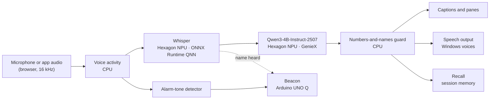

# Samvaad

**An offline AI interpreter for Snapdragon-powered Windows PCs.** Samvaad (संवाद, "dialogue") lets two people who share no language talk face to face. It captions any app or room, translates into the listener's own language, speaks the translation aloud, and checks every number and name before anyone hears it. Speech recognition and translation run on the Snapdragon Hexagon NPU. No audio leaves the laptop, and it keeps working with Wi-Fi off.

Built for the **Snapdragon® AI Lab Build & Present Challenge**, using models from **Qualcomm AI Hub**.


<sub>The interface, shown here running with the scripted test engines.</sub>

## What it does

| Mode | What you get |
| --- | --- |
| **Conversation** | Two panes, one per person, each in their own language. Hands-free mode works out who is speaking from the language; push-to-talk suits noisy rooms. Translations are spoken aloud. |
| **Live captions** | Captions for the room, or for another app or tab (Teams, Zoom, YouTube), translated into the reader's language. "Pop out" keeps the caption bar on top of other windows. |
| **Recall** | Ask questions about the session ("What dose did the doctor give?"). Answers cite the moments they come from, and any number that was never said is flagged. Summaries with action items. Export as Markdown or JSON. |
| **Plain words** | One tap rewrites a line in simple language and explains idioms. |
| **Numbers-and-names guard** | Every translation is checked: a changed digit or a lost name holds the line, which is struck through and not spoken. |
| **Beacon** | An Arduino UNO Q on the desk vibrates and flashes when a deaf user's name is said or an alarm-like tone is heard. |

## How it works



- **Speech recognition:** Whisper encoder and decoder precompiled for the Hexagon NPU, downloaded from Qualcomm AI Hub and run through ONNX Runtime's QNN Execution Provider. The decode loop is adapted from Qualcomm's own Whisper Windows sample. In conversation mode, Whisper chooses between the two people's languages only, which is how hands-free mode tells speakers apart.
- **Translation, plain words, Recall:** Qwen3-4B-Instruct-2507 on the NPU through GenieX, Qualcomm's on-device runtime, which serves an OpenAI-compatible API at `http://127.0.0.1:18181/v1`.
- **Everything else** (voice activity, the guard, the alarm detector, the session record) is small, deterministic code on the CPU. The interface is a local web page served at `http://127.0.0.1:8765`, so the browser can use the microphone.

## Requirements

- A Snapdragon X-series Windows 11 PC (X Elite, X Plus or X2), for example an HP OmniBook.
- Internet for the one-time setup (several gigabytes of downloads, mostly the translation model). After that, Samvaad runs offline.
- Microsoft Edge or Google Chrome.
- Optional: an Arduino UNO Q for Beacon.

## Setup (once, about 20 minutes)

**1. Get the code.** Download this repository as a ZIP (green **Code** button > **Download ZIP**) and extract it, or `git clone` it.

**2. Allow the scripts to run.** Open **PowerShell** in the Samvaad folder (in File Explorer, type `powershell` in the address bar) and run:

```powershell
Set-ExecutionPolicy -Scope CurrentUser RemoteSigned
Get-ChildItem -Recurse | Unblock-File
```

The second line clears the "downloaded from the internet" mark that Windows puts on files from a ZIP.

**3. Run setup.**

```powershell
.\setup.ps1
```

It installs native ARM64 Python 3.12 if needed, installs the packages, downloads Whisper for your NPU from Qualcomm AI Hub, caches the tokenizer for offline use, and finishes with a short NPU speech test. On a Snapdragon X2 laptop it picks the X2 model build automatically; to force one, use `.\setup.ps1 -Chipset qualcomm-snapdragon-x-elite`.

**4. Install GenieX and the translation model.** Download and run the GenieX installer for Windows ARM64:
<https://qaihub-public-assets.s3.us-west-2.amazonaws.com/qai-hub-geniex/geniex-cli.exe>
Windows SmartScreen may warn that it is unsigned; choose **More info > Run anyway**. Then, in a new PowerShell window, download the model once:

```powershell
geniex infer ai-hub-models/Qwen3-4B-Instruct-2507
```

Type a test sentence, check the reply, and close it.

**5. Start Samvaad.**

```powershell
.\run.ps1
```

It starts GenieX in its own window if it is not already running, then opens Samvaad in your browser. Allow the microphone when the browser asks. The chips at the top should read **Speech: Whisper-base (QNN) · NPU** and **Translator: Qwen3-4B-Instruct-2507**.

**6. Optional: set up Beacon.** Follow [beacon/README.md](beacon/README.md), then start Samvaad with `.\run.ps1 -Lan` so the board can reach the laptop over Wi-Fi.

## Using Samvaad

- **Conversation, hands-free:** choose each person's language, press **Start listening**, put the laptop between you, and talk. Pause briefly between turns.
- **Conversation, push to talk:** switch to **Push to talk** and hold your side's button while you speak.
- **Typing:** each pane has a text box, useful for names and addresses.
- **Live captions:** pick **Microphone** for the room, or **Another app or tab**, then choose the window and tick **Share audio**. Press **Pop out** for a caption bar that stays on top.
- **Recall:** ask a question, press **Summarise session**, or export the notes. **Save to this PC** writes to the `sessions` folder; nothing is saved otherwise.
- **Pinned terms:** add lines like `ASHA = आशा कार्यकर्ता` so key terms are always translated the same way.
- **Voices:** speech output uses the voices installed in Windows. For Hindi or other languages, add them in **Settings > Time & language > Language & region**, including the speech pack.

## Measured results

### The guard (measured in this repository)

`python tools/guard_eval.py` corrupts correct English-to-Hindi and English-to-Spanish translations and counts what the guard catches:

| Corruption | Caught | Cases | Rate |
| --- | ---: | ---: | ---: |
| Changed digit | 112 | 112 | 100.0% |
| Dropped number | 112 | 112 | 100.0% |
| Changed number word | 24 | 24 | 100.0% |
| Lost name | 32 | 32 | 100.0% |
| **All** | **280** | **280** | **100.0%** |

False alarms on the 16 correct translations: 0. These are synthetic corruptions of a small test set; real model errors can be subtler.

### Speed on your laptop

Run the benchmark on your own Snapdragon PC and paste the table into your presentation:

```powershell
.\.venv\Scripts\python tools\benchmark.py --runs 10
.\.venv\Scripts\python tools\benchmark.py --compare-cpu   # NPU vs CPU; needs: pip install torch
```

It reports median, mean and p90 times for Whisper on the NPU, Qwen3 translation through GenieX, and the real-time factor, and saves the results to `benchmarks/`. The **Speed** card in the interface shows the same timings live, per utterance.

## Tests

```powershell
.\.venv\Scripts\python -m pip install pytest
.\.venv\Scripts\python -m pytest
```

The tests cover the guard, voice activity detection, the alarm detector, name spotting across scripts, and the full server: live audio through the WebSocket to a translated, guarded item and a Beacon event, using scripted engines.

## Developing without a Snapdragon PC

```bash
pip install -r requirements-dev.txt
python -m samvaad --asr mock --llm mock        # scripted engines: try the interface
python -m samvaad --asr transformers           # Whisper on the CPU, plus Ollama or LM Studio for translation
```

For translation, any OpenAI-compatible server works: set `base_url` and `model` in `config.toml`, for example Ollama at `http://127.0.0.1:11434/v1` with `qwen3:4b`.

## Troubleshooting

| What you see | What to do |
| --- | --- |
| **Speech: not loaded**, "model files are missing" | Run `.\setup.ps1` again; it downloads the models into `models\whisper`. |
| "ONNX Runtime found no QNN (NPU) device" | Samvaad must run on native ARM64 Python. Delete `.venv` and run `.\setup.ps1` again. |
| `LoadCachedQnnContextFromBuffer` error | The model build does not match your chip. Delete `models\whisper` and run `.\setup.ps1 -Chipset qualcomm-snapdragon-x-elite` (or `...-x2-elite`). |
| **Translator: offline** | Start GenieX with `geniex serve` in its own window and keep it open. |
| The microphone does not start | Click the lock icon in the address bar and allow the microphone. Check **Settings > Privacy & security > Microphone**. |
| No translation is spoken | Install that language's speech voice in Windows settings, and check **Speak translations** is ticked. |
| Beacon shows **not connected** | Start with `.\run.ps1 -Lan`, allow Windows Firewall on private networks, and check the address in `beacon/python/main.py`. |

## Project structure

```
samvaad/
  server.py            local server: web page, live audio pipeline, Recall, Beacon API
  audio.py             voice activity detection and the alarm-tone detector
  guard.py             the numbers-and-names guard
  session.py           the in-memory session record and exports
  beacon.py            Beacon event queue and name spotting
  engines/asr_qnn.py   Whisper on the Hexagon NPU (ONNX Runtime QNN)
  engines/llm.py       Qwen3 through GenieX: translate, plain words, answers, summaries
  web/                 the interface (HTML, CSS, JavaScript, audio worklet)
beacon/                Arduino UNO Q app (Python + sketch) and wiring guide
tools/benchmark.py     speed on your laptop
tools/guard_eval.py    guard accuracy on corrupted translations
tests/                 pytest suite
setup.ps1, run.ps1     one-time setup and launcher for Windows on Snapdragon
```

## Privacy

Samvaad listens only while you press **Start listening**, a talk button, or **Start captions**. Audio stays in memory and is never written to disk or sent anywhere. The server binds to this PC only, unless you start it with `-Lan` for Beacon. Transcripts are saved only when you press **Save to this PC** or export. Samvaad is a communication aid, not a certified medical or legal interpreter.

## Roadmap

- Whisper-Large-V3-Turbo as an accuracy option, and speaker diarisation.
- MeloTTS and Kokoro voices on the NPU, replacing the Windows voices.
- YAMNet sound classification for Beacon (doorbell, alarm, crying baby).
- A signed MSIX installer and per-language model packs.

## Licence

Apache License 2.0; see [LICENSE](LICENSE). Third-party code and models are listed in [THIRD_PARTY_NOTICES.md](THIRD_PARTY_NOTICES.md).
