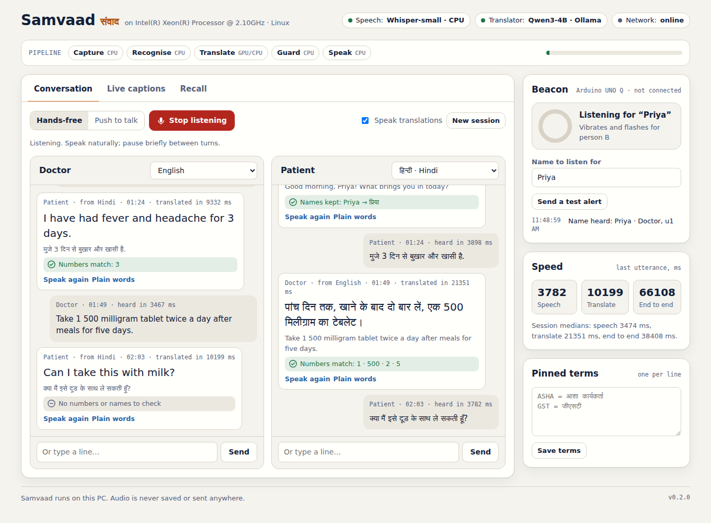
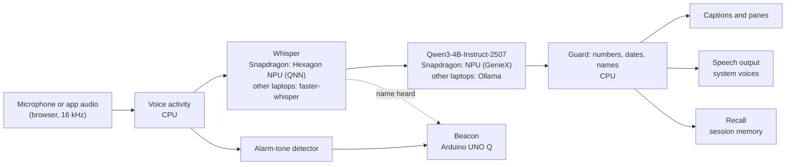

# Samvaad

**An offline AI interpreter that runs on any laptop, and runs fastest on Snapdragon PCs, where speech recognition and translation run on the NPU.** Samvaad (संवाद, "dialogue") lets two people who share no language talk face to face. It captions any app or room, translates into the listener's own language, speaks the translation aloud, and checks every number, date and name before anyone hears it. No audio leaves the laptop, and it keeps working with Wi-Fi off.

Built for the **Snapdragon® AI Lab Build & Present Challenge**, using models from **Qualcomm AI Hub**.


<sub>A real run with spoken English and Hindi: Whisper-small and Qwen3-4B (through Ollama) on a CPU-only Linux test machine. On a Snapdragon PC, the Recognise and Translate stages read NPU.</sub>

## Runs on any laptop

Every laptop runs the same two models: **Whisper** for speech recognition and **Qwen3-4B-Instruct-2507** for translation. Samvaad picks the fastest way to run them on the laptop it finds.

| Laptop | Speech (Whisper) | Translation (Qwen3-4B) | Setup |
| --- | --- | --- | --- |
| **Snapdragon PC** (X Elite, X Plus, X2), e.g. HP OmniBook | **Hexagon NPU** (ONNX Runtime QNN, precompiled by Qualcomm AI Hub) | **Hexagon NPU** (GenieX) | `setup.ps1` |
| **Windows, Intel or AMD** (HP, Dell, Lenovo, ASUS, Acer...) | CPU, or NVIDIA GPU if present (faster-whisper) | Ollama: NVIDIA/AMD GPU or CPU | `setup.ps1` |
| **Mac, Apple Silicon** (M1 to M4) | CPU (faster-whisper) | Ollama on the Mac's GPU | `setup.sh` |
| **Mac, Intel** | CPU (faster-whisper) | Ollama on the CPU | `setup.sh` |
| **Linux** | CPU, or NVIDIA GPU | Ollama | `setup.sh` |

Macs need macOS 14 Sonoma or newer for Ollama. The interface shows what it picked, e.g. **Speech: Whisper-small · CPU** and **Translator: Qwen3-4B · Ollama**, or **NPU** on a Snapdragon PC.

## Quick start

You need an internet connection once, for about 3 GB of downloads (mostly the translation model). After that, Samvaad works offline. Use **Google Chrome** or **Microsoft Edge**.

### Mac or Linux

Open **Terminal** and paste:

```bash
cd ~ && curl -L https://github.com/mayankmajoka2000-tech/samvaad/archive/refs/heads/main.zip -o samvaad.zip && unzip -q -o samvaad.zip && cd samvaad-main && bash setup.sh
```

When it says **Setup complete**, start Samvaad:

```bash
bash run.sh
```

Next time, open Terminal and run `cd ~/samvaad-main && bash run.sh`.

`setup.sh` finds Python 3.11 to 3.13 (or installs Python 3.12 in your home folder with [uv](https://docs.astral.sh/uv/), without admin rights), installs the packages, downloads Whisper, installs [Ollama](https://ollama.com) and the Qwen3 model, and runs a quick test. Options: `bash setup.sh --whisper=base` for a smaller, faster speech model; `bash setup.sh --no-translator` to skip Ollama.

### Windows (Snapdragon, Intel or AMD)

Open **PowerShell** from the Start menu and paste:

```powershell
cd ~; irm https://github.com/mayankmajoka2000-tech/samvaad/archive/refs/heads/main.zip -OutFile samvaad.zip; Expand-Archive samvaad.zip . -Force; cd samvaad-main; Set-ExecutionPolicy -Scope Process Bypass -Force; .\setup.ps1
```

When it says **Setup complete**, start Samvaad:

```powershell
.\run.ps1
```

Next time, open PowerShell and run `cd ~\samvaad-main; powershell -ExecutionPolicy Bypass -File .\run.ps1`.

`setup.ps1` checks which processor the laptop has:

- **Intel or AMD:** installs Python 3.12, faster-whisper, Whisper, Ollama and the Qwen3 model (with winget), then runs a quick test.
- **Snapdragon:** installs native ARM64 Python 3.12, downloads Whisper precompiled for your NPU from Qualcomm AI Hub (it picks the X2 build on X2 laptops), and runs an NPU speech test. Then install GenieX once for translation on the NPU:
  1. Download and run the Windows ARM64 installer: <https://qaihub-public-assets.s3.us-west-2.amazonaws.com/qai-hub-geniex/geniex-cli.exe>. If SmartScreen warns that it is unsigned, choose **More info > Run anyway**.
  2. In a new PowerShell window, download the model once with `geniex infer ai-hub-models/Qwen3-4B-Instruct-2507`, type a test sentence, check the reply, and close it.

  `run.ps1` then starts GenieX for you. (Ollama also works on Snapdragon if you prefer it.)

### Try the interface without any models

`bash run.sh --mock` (Mac, Linux) or `.\run.ps1 -Mock` (Windows) runs scripted speech and translations, so you can see everything in a minute.

### Optional: Beacon

Follow [beacon/README.md](beacon/README.md), then start Samvaad with `bash run.sh --lan` or `.\run.ps1 -Lan` so the board can reach the laptop over Wi-Fi.

## What it does

| Mode | What you get |
| --- | --- |
| **Conversation** | Two panes, one per person, each in their own language. Hands-free mode works out who is speaking from the language; push-to-talk suits noisy rooms. Translations are spoken aloud. |
| **Live captions** | Captions for the room, or for another app or tab (Teams, Zoom, YouTube), translated into the reader's language. "Pop out" keeps the caption bar on top of other windows. |
| **Recall** | Ask questions about the session ("What dose did the doctor give?"). Answers cite the moments they come from, and any number that was never said is flagged. Summaries with action items. Export as Markdown or JSON. |
| **Plain words** | One tap rewrites a line in simple language and explains idioms. |
| **The guard** | Every translation is checked. A changed digit, day or month, or a lost name, holds the line: it is struck through and not spoken. Changed number words or a changed time of day ("morning" becoming "evening") ask the listener to confirm. |
| **Beacon** | An Arduino UNO Q on the desk vibrates and flashes when a deaf user's name is said or an alarm-like tone is heard. |

## How it works



- **Speech recognition.** On a Snapdragon PC: the Whisper encoder and decoder precompiled for the Hexagon NPU, downloaded from Qualcomm AI Hub and run through ONNX Runtime's QNN Execution Provider; the decode loop is adapted from Qualcomm's own Whisper Windows sample. On other laptops: the same Whisper through [faster-whisper](https://github.com/SYSTRAN/faster-whisper) with 8-bit weights on the CPU, or an NVIDIA GPU. In Conversation mode, Whisper chooses between the two people's languages only, which is how hands-free mode tells speakers apart.
- **Translation, plain words, Recall.** Qwen3-4B-Instruct-2507 behind an OpenAI-compatible API: GenieX on the NPU at `http://127.0.0.1:18181/v1`, or Ollama at `http://127.0.0.1:11434/v1` (model `qwen3:4b-instruct-2507-q4_K_M`). With the default `engine = "auto"`, Samvaad uses whichever is running, GenieX first, and switches if you start one later.
- **Everything else** (voice activity, the guard, the alarm detector, the session record) is small, deterministic code on the CPU. The interface is a local web page at `http://127.0.0.1:8765`, so the browser can use the microphone.

## Results

### Whisper on the Snapdragon NPU (published by Qualcomm AI Hub)

Qualcomm measures every AI Hub model on real devices. For the precompiled Whisper models Samvaad uses (`qai-hub-models` 0.63.0):

| Model | Device | Encoder, per 30 s window | Decoder, per token |
| --- | --- | ---: | ---: |
| Whisper-Base | Snapdragon X Elite | 45.5 ms | 3.8 ms |
| Whisper-Base | Snapdragon X2 Elite | 21.6 ms | 2.5 ms |
| Whisper-Small | Snapdragon X Elite | 117.1 ms | 10.5 ms |

A 20-token sentence therefore takes roughly 45 + 20 × 3.8 ≈ 120 ms of NPU time with Whisper-Base on an X Elite. You can print these figures, or measure them yourself on a real Snapdragon laptop in Qualcomm's cloud, **from any laptop** (a free Qualcomm ID and an API token from [AI Hub](https://aihub.qualcomm.com), under Account > Settings > API Token):

```bash
pip install qai-hub-models
qai-hub-models perf Whisper-Base                  # the published numbers
qai-hub configure --api_token YOUR_TOKEN          # once
qai-hub-models install whisper_base
qai-hub-models export whisper_base --device "Snapdragon X Elite CRD" --target-runtime precompiled_qnn_onnx
```

### Speed on your laptop

```bash
.venv/bin/python tools/benchmark.py --runs 10                      # Mac, Linux
.\.venv\Scripts\python tools\benchmark.py --runs 10                # Windows
.\.venv\Scripts\python tools\benchmark.py --compare-cpu            # Snapdragon: NPU vs CPU
```

It reports median, mean and p90 times for speech recognition and translation, with the real-time factor, and saves them to `benchmarks/`. The **Speed** card in the interface shows the same timings live, per utterance.

For a lower bound, on a 2-core cloud machine with no GPU (an Intel Xeon, far slower than any recent laptop), Whisper-small took 1.6 s for a 4.9 s clip, and Qwen3-4B took about 10 to 30 s per sentence on the CPU. It worked end to end, just slowly. A laptop's GPU (Apple Silicon or NVIDIA) or the Snapdragon NPU is much faster; run the benchmark to get your own numbers.

### The guard (measured in this repository)

`python tools/guard_eval.py` corrupts correct English-to-Hindi and English-to-Spanish translations and counts what the guard catches:

| Corruption | Caught | Cases | Rate |
| --- | ---: | ---: | ---: |
| Changed digit | 120 | 120 | 100.0% |
| Dropped number | 120 | 120 | 100.0% |
| Changed number word | 24 | 24 | 100.0% |
| Changed day or month | 40 | 40 | 100.0% |
| Changed time of day | 24 | 24 | 100.0% |
| Lost name | 32 | 32 | 100.0% |
| **All** | **360** | **360** | **100.0%** |

False alarms on the 20 correct translations: 0. These are synthetic corruptions of a small test set; real model errors can be subtler. One real example the guard now catches: while testing on a CPU-only laptop, the 4-bit Qwen3-4B translated "Friday, 2 October, at 10 in the morning" as "Saturday ... 10 in the evening". The guard holds that line.

## Using Samvaad

- **Conversation, hands-free:** choose each person's language, press **Start listening**, put the laptop between you, and talk. Pause briefly between turns.
- **Conversation, push to talk:** switch to **Push to talk** and hold your side's button while you speak.
- **Typing:** each pane has a text box, useful for names and addresses.
- **Live captions:** pick **Microphone** for the room, or **Another app or tab**, then choose the window and tick **Share audio**. Press **Pop out** for a caption bar that stays on top (Chrome and Edge).
- **Recall:** ask a question, press **Summarise session**, or export the notes. **Save to this laptop** writes to the `sessions` folder; nothing is saved otherwise.
- **Pinned terms:** add lines like `ASHA = आशा कार्यकर्ता` so key terms are always translated the same way.
- **Voices:** speech output uses the voices installed on the laptop.
  - Windows: **Settings > Time & language > Language & region**, add the language with its speech pack.
  - Mac: **System Settings > Accessibility > Spoken Content > System voice > Manage Voices**, e.g. Hindi (Lekha).
- **Speech model size:** on laptops other than Snapdragon, `cpu_model_size` in `config.toml` sets the Whisper size: `base` is faster, `small` (the default) is more accurate and writes Hindi in Devanagari, `medium` is more accurate still but slower.

## Tests

```bash
.venv/bin/python -m pip install pytest && .venv/bin/python -m pytest        # Mac, Linux
.\.venv\Scripts\python -m pip install pytest; .\.venv\Scripts\python -m pytest   # Windows
```

41 tests cover the guard, voice activity detection, the alarm detector, name spotting across scripts, the NPU decode loop (with simulated ONNX sessions), engine selection on every kind of laptop, translator fallback, and the full server: live audio through the WebSocket to a translated, guarded item and a Beacon event, using scripted engines.

## Troubleshooting

| What you see | What to do |
| --- | --- |
| **Speech: not loaded**, "not installed yet" | Run the setup script again (`bash setup.sh` or `.\setup.ps1`). |
| **Translator: offline** | Mac: open the **Ollama** app. Windows: open **Ollama** from the Start menu (Snapdragon: run `geniex serve` and keep it open). Linux: run `ollama serve`. Then run `ollama pull qwen3:4b-instruct-2507-q4_K_M` once if it is not downloaded. |
| Translations are slow | The first sentence loads the model (a few seconds). On laptops without a GPU or NPU, use `bash setup.sh --whisper=base` and keep other apps closed. |
| Hindi appears in Urdu script | Whisper-Base does this. On Intel, AMD and Mac laptops, keep `cpu_model_size = "small"`. On Snapdragon, a Whisper-Small NPU build can be exported with `qai-hub-models export whisper_small`. |
| "ONNX Runtime found no QNN (NPU) device" | Snapdragon only: Samvaad must run on native ARM64 Python. Delete `.venv` and run `.\setup.ps1` again. |
| `LoadCachedQnnContextFromBuffer` error | Snapdragon only: the model build does not match your chip. Delete `models\whisper` and run `.\setup.ps1 -Chipset qualcomm-snapdragon-x-elite` (or `...-x2-elite`). |
| "running scripts is disabled on this system" | Windows: run `Set-ExecutionPolicy -Scope Process Bypass -Force` in that window first, or start with `powershell -ExecutionPolicy Bypass -File .\run.ps1`. |
| Linux: Ollama install fails asking for zstd | `sudo apt install zstd`, then run `bash setup.sh` again. |
| The microphone does not start | Click the lock icon in the address bar and allow the microphone. Also allow the browser in **Settings > Privacy & security > Microphone** (Windows) or **System Settings > Privacy & Security > Microphone** (Mac). |
| No translation is spoken | Install that language's voice (see **Voices** above), and check **Speak translations** is ticked. |
| Beacon shows **not connected** | Start with `--lan` / `-Lan`, allow the firewall prompt on private networks, and check the address in `beacon/python/main.py`. |

## Project structure

```
samvaad/
  server.py               local server: web page, live audio pipeline, Recall, Beacon API
  platform_info.py        which laptop this is (Snapdragon, Mac, Windows, Linux) and fix-it hints
  audio.py                voice activity detection and the alarm-tone detector
  guard.py                the guard: numbers, days, months, times of day and names
  session.py              the in-memory session record and exports
  beacon.py               Beacon event queue and name spotting
  engines/__init__.py     picks the speech engine for this laptop
  engines/asr_qnn.py      Whisper on the Hexagon NPU (ONNX Runtime QNN)
  engines/asr_faster.py   Whisper on any other laptop (faster-whisper, CPU or NVIDIA GPU)
  engines/llm.py          Qwen3 through GenieX or Ollama: translate, plain words, answers, summaries
  web/                    the interface (HTML, CSS, JavaScript, audio worklet)
beacon/                   Arduino UNO Q app (Python + sketch) and wiring guide
tools/benchmark.py        speed on your laptop
tools/guard_eval.py       guard accuracy on corrupted translations
tests/                    pytest suite
setup.ps1, run.ps1        setup and launcher for Windows (Snapdragon, Intel, AMD)
setup.sh, run.sh          setup and launcher for Mac and Linux
requirements.txt          packages for any laptop
requirements-snapdragon.txt  packages for the NPU build
```

## Privacy

Samvaad listens only while you press **Start listening**, a talk button, or **Start captions**. Audio stays in memory and is never written to disk or sent anywhere. The server binds to this laptop only, unless you start it with `--lan` for Beacon. Transcripts are saved only when you press **Save to this laptop** or export. Samvaad is a communication aid, not a certified medical or legal interpreter.

## Roadmap

- Whisper-Small and Whisper-Large-V3-Turbo NPU builds as accuracy options, and speaker diarisation.
- MeloTTS and Kokoro voices on the NPU, replacing the system voices.
- YAMNet sound classification for Beacon (doorbell, alarm, crying baby).
- Signed installers (MSIX for Windows, a notarised app for Mac) and per-language model packs.

## Licence

Apache License 2.0; see [LICENSE](LICENSE). Third-party code and models are listed in [THIRD_PARTY_NOTICES.md](THIRD_PARTY_NOTICES.md).
